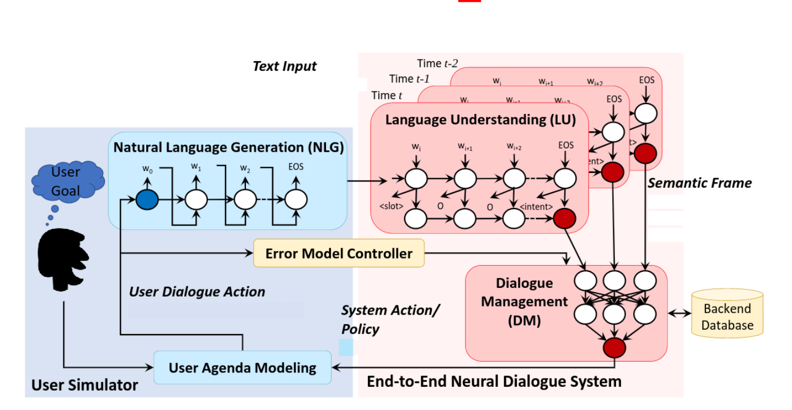

AI Agent Asistant
=====
<!--- These are examples. See https://shields.io for others or to customize this set of shields. You might want to include dependencies, project status and licence info here --->


[F22] Reinforcement Learning Final Exam at `Innopolis university`

### Prerequisites

Before you begin, ensure you have met the following requirements:

* You have installed the latest version of `Python`
* You have a `Windows/Linux/Mac` machine.
* You have read `README.md`.
* Optional: You have `Docker` and `docker-compose` installed.

### Installing requirements and running

_If you have docker on your machine then you can skip to the next section._

To install requirements, follow these steps:

```shell
conda create -n bot python=3.9 -y && conda activate bot
pip install -r requirements.txt
python -u app.py
```

### Using Docker

To use Docker, follow these steps:

```shell
docker build -t bot .
docker run -it --rm bot
```

or

```shell
docker-compose up -d --build
docker-compose logs # to see logs
```

## Chatbot results

Let me show you some chatbot's results:

### Chatbot's working structure

If there is an answer to the question in the base of the bot, the bot will answer.


You can improve the bot's response by giving feedback, select one of the "Yes" and "No" buttons below.


The question is sent to the admins, and when they receive the answer, they add it to the database.


you can find more results from chatbot in <a href='result' target="_blank">this directory</a> neural networks' configs
of those results are described in the filename

### Project Framework
Framework divides into tow main parts:
* User Simulator
* End-to-End Neural Dialogue system



# Authors

* [@YoshlikMedia](https://github.com/yoshlikmedia)
* [@ParthKalkar](https://github.com/Odilbek99) 
