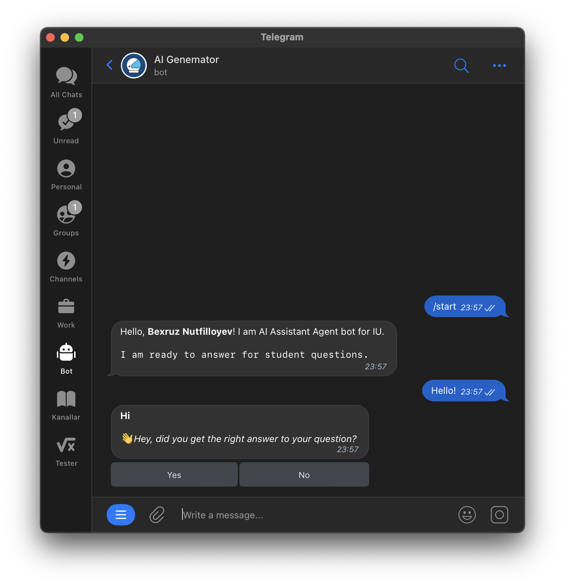
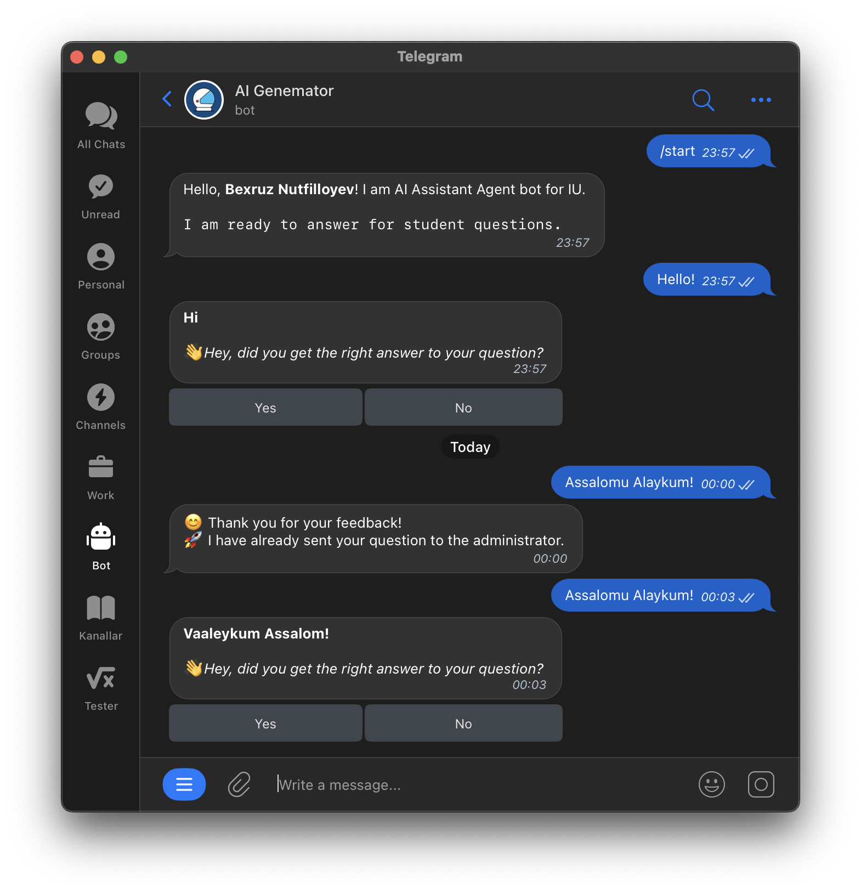

# AI Agent Asistant

## Chatbot results

Let me show you some chatbot's results:

### Chatbot's working structure

If there is an answer to the question in the base of the bot, the bot will answer.

You can improve the bot's response by giving feedback, select one of the "Yes" and "No" buttons below.

The question is sent to the admins, and when they receive the answer, they add it to the database.

you can find more results from chatbot in <a href='result' target="_blank">this directory</a>

neural networks' configs of those results are described in the filename

